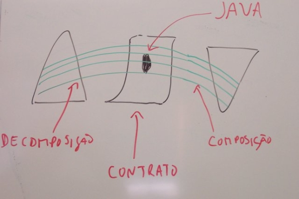

#DbC4J: Design by Contract for Java

DbC4J is a library that allows performing Design by Contract in Java, by enforcing contract clauses using regular Java methods via naming conventions. This library is a _prototype_, developed in the context of my Master Thesis, "An Aspect-Oriented Infrastructure for Design by Contract in Java". 

_(translated from Portuguese: decomposition, contract, composition)_
